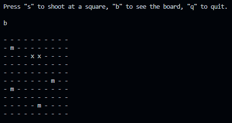
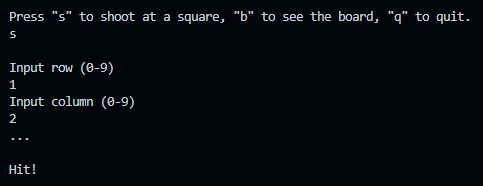

# Battleship C# Game
---
A simple game of battleship, playable within the console

## Background
---
We re-created the game of Battleship. This game has been around for many years and is a classic from most peoples childhoods,
within C#, where you can play against the computer

## Why?
---
To bring back classic memories from the past and We hope that you'll have fun playing it and maybe share it with your friends.

## How to play?
---
To play our battleship game to play press (P) if you would like to quit press (Q), To shoot press (S), to see the board press (B), Press (Z) to see the board, Once pressed (S) you can select a row 0-9 then select a column 0-9. 

## Screenshots
---

[//]: # (Need to add screenshots and explaination. Maybe add more detail to text)